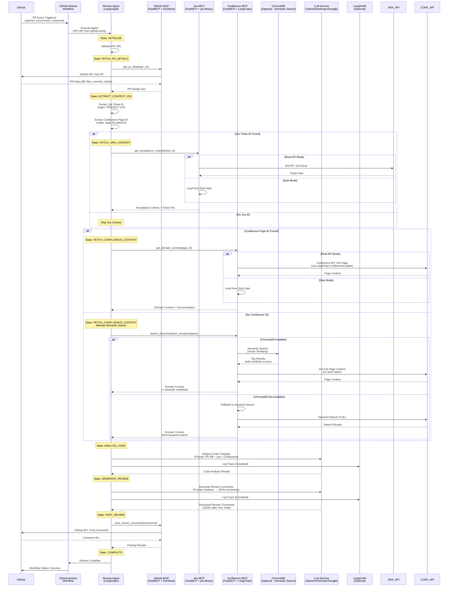
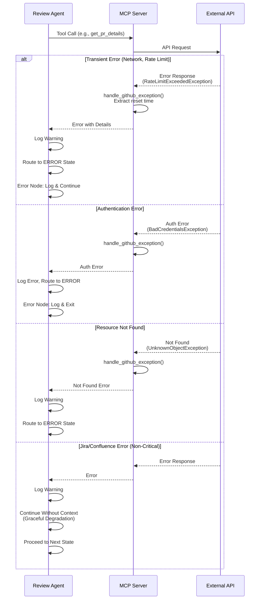

# Data Flow Sequence Diagram

## PR Review Execution Flow

## Error Handling Flow

## Key Implementation Details

### MCP Server Error Handling
- **GitHub MCP**: Uses `handle_github_exception()` for detailed error messages
- **Jira MCP**: Graceful fallback to stub data if real API fails
- **Confluence MCP**: Graceful fallback to stub data if real API fails

### Agent Error Handling
- **Critical Errors** (PR fetch failure): Route to ERROR state, exit
- **Non-Critical Errors** (Jira/Confluence): Log warning, continue with available data
- **LLM Errors**: Retry logic, fallback to error state if persistent

### Graceful Degradation Strategy
- PR details: **Required** - failure blocks review
- Jira context: **Optional** - failure doesn't block review
- Confluence context: **Optional** - failure doesn't block review
- Review generation: **Required** - failure blocks posting

