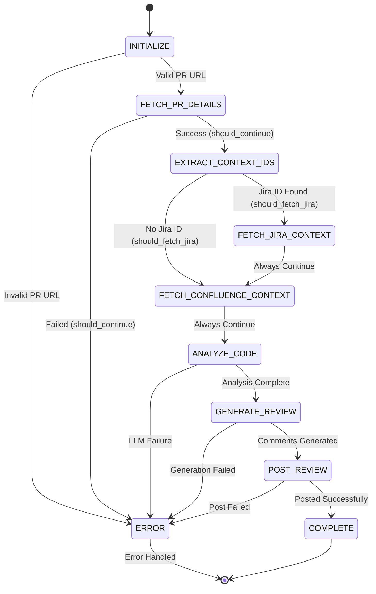

# State Machine Workflow Diagram

## Agent State Flow

## State Descriptions

- **INITIALIZE**: Entry point, validates PR URL format
- **FETCH_PR_DETAILS**: Calls GitHub MCP `get_pr_details()` tool
- **EXTRACT_CONTEXT_IDS**: Parses PR description/labels for Jira ticket IDs and Confluence page IDs
- **FETCH_JIRA_CONTEXT**: Calls Jira MCP `get_acceptance_criteria()` tool (optional, graceful degradation)
- **FETCH_CONFLUENCE_CONTEXT**: Calls Confluence MCP with hybrid approach:
  - If page ID: `get_domain_context()` (direct lookup)
  - If no page ID: `search_documentation_semantic()` (ChromaDB) → fallback to keyword search
  - Optional, graceful degradation
- **ANALYZE_CODE**: LLM analyzes code changes with all available context (PR diff, Jira criteria, Confluence docs)
- **GENERATE_REVIEW**: LLM generates structured review comments in JSON format
- **POST_REVIEW**: Calls GitHub MCP `post_review_comments()` tool to post comments
- **ERROR**: Handles errors gracefully, logs details
- **COMPLETE**: Final state, review posted successfully

## Conditional Routing

- **should_continue()**: Routes after `FETCH_PR_DETAILS` based on success/failure
- **should_fetch_jira()**: Routes after `EXTRACT_CONTEXT_IDS` based on Jira ticket ID presence

## Graceful Degradation

- Jira/Confluence context fetching failures don't block the review
- Agent continues with available data (PR details always required)
- Missing context is noted but review proceeds

