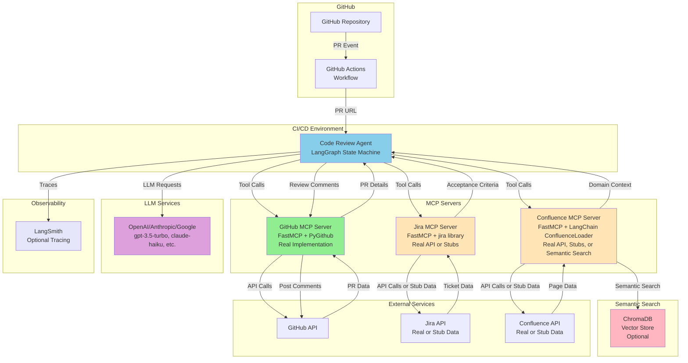

# System Architecture Diagram

## Component Architecture

## Legend
- **Solid lines**: Active data flow
- **Green**: Real implementation (GitHub MCP - always real)
- **Orange**: Dual mode (Jira/Confluence MCP - real API or stubs)
- **Pink**: Optional semantic search (ChromaDB)
- **Blue**: Agent component
- **Purple**: LLM service
- **Lavender**: Optional observability

## Key Features

- **GitHub Actions Integration**: Primary trigger mechanism (also supports Jenkins, other CI/CD)
- **MCP Architecture**: All external data access via MCP servers
- **Dual Mode Support**: Jira/Confluence can use real APIs or stub data
- **Semantic Search**: ChromaDB integration for automatic Confluence doc discovery
- **Multi-LLM Support**: OpenAI, Anthropic, Google providers
- **LangSmith Integration**: Optional observability and tracing

